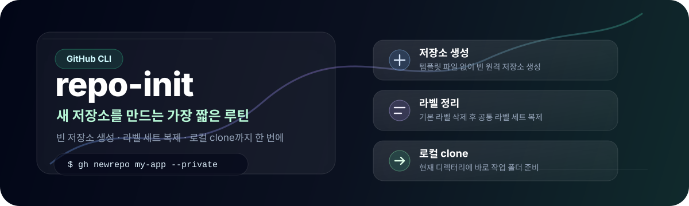

<p align="center">
  
</p>

# repo-init

GitHub에서 **이미 만든 저장소**에 공통 라벨 세트와 이슈/PR 템플릿을 적용하는 설정 저장소입니다.

새 저장소를 만드는 기능도 제공하지만, 주된 사용 흐름은 저장소를 만든 뒤 이 문서의 명령으로 협업 규칙을 적용하는 것입니다.

## 빠른 시작: 기존 저장소에 전체 적용

대상 저장소를 로컬에 clone한 뒤, 그 저장소의 최상위 디렉터리에서 아래 블록을 실행하세요. 기본 라벨을 포함한 기존 라벨을 지우고 repo-init의 라벨 세트를 적용하며, 이슈/PR 템플릿을 커밋하고 push합니다.

### 사전 조건

- [GitHub CLI](https://cli.github.com/)에 로그인되어 있어야 합니다: `gh auth login`
- 템플릿 커밋을 위해 Git 사용자 정보를 설정해야 합니다.
- 대상 저장소에 push할 권한이 있어야 합니다.

```bash
git config --global user.name "이름"
git config --global user.email "email@example.com"
```

### 적용 명령

```bash
# 대상 저장소의 최상위 디렉터리에서 실행합니다.
(
  set -euo pipefail
  TARGET="$(gh repo view --json nameWithOwner --jq .nameWithOwner)"
  TEMPLATE_DIR="$(mktemp -d)"
  trap 'rm -rf "${TEMPLATE_DIR}"' EXIT

  git clone --depth 1 https://github.com/jaehunshin-git/repo-init.git "${TEMPLATE_DIR}"

  # 대상 저장소의 기존 라벨을 모두 삭제한 뒤 표준 라벨 세트를 적용합니다.
  gh label list --repo "${TARGET}" --json name --jq '.[].name' |
  while IFS= read -r label; do
    [ -z "${label}" ] || gh label delete "${label}" --repo "${TARGET}" --yes
  done
  gh label clone jaehunshin-git/repo-init --repo "${TARGET}" --force

  # 이슈/PR 템플릿을 복사하고 현재 브랜치에 반영합니다.
  mkdir -p .github
  cp -R "${TEMPLATE_DIR}/.github/ISSUE_TEMPLATE" .github/
  cp "${TEMPLATE_DIR}/.github/PULL_REQUEST_TEMPLATE.md" .github/

  git add .github
  if ! git diff --cached --quiet; then
    git commit -m "chore: 이슈 및 PR 템플릿 추가"
    git push
  fi
)
```

> 주의: 이 명령은 대상 저장소의 **모든 기존 라벨을 삭제**합니다. 기존 라벨을 유지해야 하면 아래의 라벨만 추가하기 방식을 사용하세요. 템플릿과 이름이 같은 파일은 덮어쓰며, 그 밖의 `.github` 파일은 유지합니다.

### 라벨만 추가하기

기존 라벨은 유지하고, 같은 이름의 라벨은 갱신하며 없는 라벨만 추가합니다.

```bash
gh label clone jaehunshin-git/repo-init --repo 내아이디/대상저장소 --force
```

## 적용되는 항목

### 이슈 및 PR 템플릿

아래 파일을 대상 저장소의 `.github` 디렉터리에 복사합니다.

```text
.github/
├── ISSUE_TEMPLATE/
│   ├── config.yml
│   ├── docs.yml
│   ├── feature.yml
│   ├── fix.yml
│   ├── init.yml
│   └── refactor.yml
└── PULL_REQUEST_TEMPLATE.md
```

- PR 제목: `type: 작업 내용` — 예: `feat: 로그인 기능 추가`
- Issue 제목: `[type] 작업 내용` — 예: `[feat] 로그인 기능 추가`
- 이슈 템플릿은 아래 라벨 세트와 연결됩니다.

### 라벨 세트

`✨ feature` · `🐛 bug` · `📝 docs` · `♻️ refactor` · `✅ test` · `🧹 chore` · `🚧 in progress` · `⛔ blocked` · `💬 discussion` · `🙅 wontfix` · `🔥 P1` · `⚡ P2` · `🌱 P3`

## 새 저장소 만들기 (보조 기능)

`create-repo.sh`는 새 로컬 Git 저장소를 만들고 템플릿을 첫 커밋으로 추가합니다. `--remote`, `--private`, `--public` 옵션을 지정하면 GitHub 원격 저장소 생성과 라벨 적용, push까지 처리합니다.

```bash
git clone https://github.com/jaehunshin-git/repo-init.git
./repo-init/create-repo.sh 새저장소이름
./repo-init/create-repo.sh 새저장소이름 --private
./repo-init/create-repo.sh 새저장소이름 --public
```

| 명령 | 결과 |
| --- | --- |
| `./create-repo.sh 새저장소이름` 또는 `--local` | 로컬 Git 저장소와 템플릿 커밋 생성 |
| `./create-repo.sh 새저장소이름 --remote` 또는 `--private` | 비공개 GitHub 원격 저장소까지 생성 |
| `./create-repo.sh 새저장소이름 --public` | 공개 GitHub 원격 저장소까지 생성 |

원격 모드에서는 새 저장소의 기본 라벨을 삭제한 뒤 이 저장소의 라벨 세트를 적용합니다. 생성 중 실패하면 원격 저장소가 남을 수 있으므로 GitHub에서 상태를 확인하세요.
